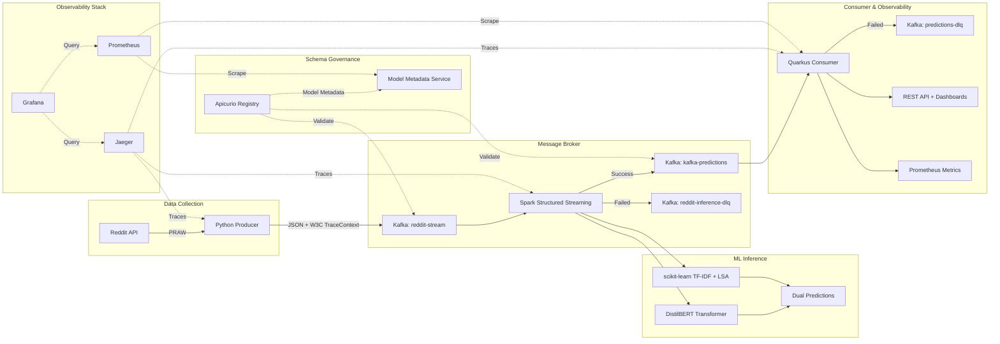

# Reddit Realtime Flair Classification

A production-grade distributed ML pipeline that classifies Reddit posts from r/AskEurope using dual-model inference (Transformer + scikit-learn), with end-to-end observability, failure handling, and schema governance.

## Architecture



### Pipeline Flow

1. **Producer** -- Python script polls Reddit API (r/AskEurope), cleans text (stopwords, lemmatization, URL normalization), injects W3C TraceContext into Kafka headers, and publishes to `reddit-stream`. On persistent Kafka failures, writes to a local DLQ file. Uses exponential backoff with jitter on errors (1s base, 2x growth, 5min cap).

2. **Spark Inference** -- Structured Streaming job (1-minute micro-batch, `maxOffsetsPerTrigger=100`) reads from Kafka and applies two models in parallel via a PySpark UDF:
   - **Transformer**: Fine-tuned DistilBERT with label encoder (13 flair categories)
   - **scikit-learn**: TF-IDF + Truncated SVD (LSA) + classifier pipeline
   - Each model is wrapped in its own OpenTelemetry span for latency tracking
   - Failed inferences are routed to `reddit-inference-dlq` via a `__dlq` flag in the output

3. **Consumer** -- Quarkus app consumes predictions via SmallRye Reactive Messaging (pull-based backpressure), tracks model agreement rate, confidence distributions, and exposes metrics at `/q/metrics`. Failed messages go to `predictions-dlq` via SmallRye's built-in DLQ strategy.

4. **Model Metadata** -- Quarkus service validates ML model metadata against JSON Schema registered in Apicurio Registry with BACKWARD compatibility rules. Retries registry calls with linear backoff (3 attempts), returns 503 on exhaustion.

### Key Design Decisions

| Decision | Choice | Rationale | ADR |
|----------|--------|-----------|-----|
| Dual-model inference | Transformer + sklearn | Agreement rate as reliability proxy without ground truth | [ADR-001](docs/adr/adr-001-dual-model-inference.md) |
| Dead letter queues | Per-component DLQ strategy | No silent data loss; SmallRye DLQ (consumer), UDF flag (Spark), file (producer) | [ADR-002](docs/adr/adr-002-dlq-strategy.md) |
| Backpressure | Exponential backoff + maxOffsetsPerTrigger | Each component degrades gracefully under load | [ADR-003](docs/adr/adr-003-backpressure-design.md) |
| Schema governance | Apicurio Registry + JSON Schema | Explicit versioned contracts; BACKWARD compatibility enforcement | [ADR-004](docs/adr/adr-004-schema-governance.md) |
| Observability | OTel + Prometheus + Grafana + Jaeger | End-to-end tracing, custom metrics, pre-provisioned dashboards | [ADR-005](docs/adr/adr-005-observability-strategy.md) |

### Observability

**Distributed Tracing (OpenTelemetry + Jaeger)**
- Producer injects W3C `traceparent` into Kafka headers
- Spark creates manual spans per model (`transformer-inference`, `sklearn-inference`) with `reddit.post.id` for correlation
- Quarkus auto-instruments via `quarkus-opentelemetry`

**Metrics (Prometheus)**
- `flair_messages_total{model, flair}` -- Counter per model per flair
- `flair_processing_latency_seconds` -- Histogram of per-message processing time
- `model_agreement_rate` -- Rolling agreement gauge between models
- `pipeline_messages_total{stage}` -- Counter with stage label
- `model_confidence_latest{model}` -- Latest confidence per model

**Dashboards (Grafana)**
- **Pipeline Overview** -- Message rates, error rate, flair distribution, latency (p50/p95/p99), agreement rate
- **Model Comparison** -- Transformer vs sklearn prediction distribution, per-model flair breakdown
- **System Health** -- JVM heap, GC pauses, HTTP latency, CPU, threads

**HTML Dashboards (built-in)**

| Dashboard | Endpoint | Description |
|-----------|----------|-------------|
| Metrics Overview | `/metrics.html` | Flair counts, confidence, agreement rates |
| Confusion Matrix | `/confusion-matrix.html` | Transformer vs sklearn alignment |
| Confidence Distribution | `/confidence-distribution.html` | Histogram of confidence scores |
| Agreement Over Time | `/agreement-over-time.html` | Agreement rate trends |
| Flair Timeline | `/flair-drift.html` | Flair distribution over time |
| Uncertainty Zones | `/model-uncertainty.html` | Confident / uncertain / disagreement |
| System Load | `/system-load.html` | Throughput and error rates |

### Flair Categories

The models classify posts into 13 categories: Work, Misc, Food, Personal, Meta, Sports, Travel, Politics, Culture, History, Education, Language, Foreign.

## Project Structure

```
├── model/                              # Training artifacts
│   ├── model_training.ipynb            # Jupyter notebook for model training
│   ├── data_collection.py              # Reddit data collection script
│   ├── cleaning.py                     # Text preprocessing utilities
│   ├── reddit_classifier.pkl           # Trained sklearn classifier
│   ├── vectorizer.pkl                  # TF-IDF vectorizer
│   └── LSA_topics.pkl                  # Truncated SVD model
├── runtime/
│   ├── kafka/
│   │   ├── kafka_cluster.yaml          # Strimzi Kafka cluster (KRaft mode)
│   │   ├── dlq-topics.yaml             # DLQ KafkaTopic CRDs
│   │   ├── producer/
│   │   │   ├── reddit_posts_processor.py   # Reddit → Kafka producer (OTel + DLQ + backoff)
│   │   │   ├── cleaning.py                 # Text cleaning pipeline
│   │   │   ├── Dockerfile
│   │   │   └── reddit_posts_processor.yaml # K8s Deployment (health probes, resource limits)
│   │   └── consumer/
│   │       ├── flair-consumer/             # Quarkus app
│   │       │   ├── src/main/java/uoc/edu/
│   │       │   │   ├── BaseResource.java              # Kafka consumer + custom metrics
│   │       │   │   ├── StatisticsResource.java        # /flairs/statistics
│   │       │   │   ├── ConfusionMatrixResource.java   # /flairs/confusion-matrix
│   │       │   │   └── ...                            # Other REST resources
│   │       │   └── src/test/java/uoc/edu/
│   │       │       └── FlairConsumerTest.java         # 10 unit tests
│   │       ├── flair_consumer.yaml         # K8s Deployment + Service
│   │       └── outgoing_topic.yaml         # Kafka topic definition
│   ├── spark/
│   │   ├── reddit_flair_spark_inference.py  # Dual-model inference (OTel + DLQ + backpressure)
│   │   ├── Dockerfile
│   │   └── reddit_flair_spark_inference.yaml # SparkApplication CRD
│   ├── registry/
│   │   └── apicurio-registry.yaml          # Apicurio Registry K8s Deployment
│   ├── model-metadata/
│   │   ├── src/main/java/io/apicurio/
│   │   │   └── ModelController.java        # Schema validation + retry logic
│   │   └── model-metadata.yaml             # K8s Deployment
│   └── observability/
│       ├── jaeger.yaml                     # Jaeger all-in-one (OTel collector)
│       ├── prometheus.yaml                 # Prometheus + scrape config
│       ├── grafana.yaml                    # Grafana + datasources
│       └── grafana-dashboards.yaml         # 3 pre-provisioned dashboards
├── schemas/
│   ├── reddit-stream-value.json            # JSON Schema for reddit-stream topic
│   ├── kafka-predictions-value.json        # JSON Schema for kafka-predictions topic
│   └── register-schemas.sh                 # Schema registration script for Apicurio
├── docs/
│   └── adr/
│       ├── adr-001-dual-model-inference.md
│       ├── adr-002-dlq-strategy.md
│       ├── adr-003-backpressure-design.md
│       ├── adr-004-schema-governance.md
│       └── adr-005-observability-strategy.md
```

## Installation

### Prerequisites

- Kubernetes cluster (Minikube, OpenShift, or cloud)
- kubectl / oc CLI
- Helm (for Spark Operator)
- Reddit API credentials (stored as K8s Secret)

### 1. Create Namespace & Install Operators

```bash
kubectl create namespace reddit-realtime

# Strimzi Kafka Operator
kubectl apply -f https://strimzi.io/install/latest?namespace=reddit-realtime -n reddit-realtime

# Spark Operator
helm repo add spark-operator https://kubeflow.github.io/spark-operator
helm install spark-operator spark-operator/spark-operator --namespace spark-operator --create-namespace --wait
```

### 2. Deploy Kafka Cluster & Topics

```bash
kubectl apply -f runtime/kafka/kafka_cluster.yaml
kubectl apply -f runtime/kafka/producer/incoming_topic.yaml
kubectl apply -f runtime/kafka/consumer/outgoing_topic.yaml
kubectl apply -f runtime/kafka/dlq-topics.yaml
```

### 3. Deploy Schema Registry & Register Schemas

```bash
kubectl apply -f runtime/registry/apicurio-registry.yaml
# Wait for registry to be ready, then:
./schemas/register-schemas.sh
```

### 4. Deploy Observability Stack

```bash
kubectl apply -f runtime/observability/jaeger.yaml
kubectl apply -f runtime/observability/prometheus.yaml
kubectl apply -f runtime/observability/grafana.yaml
kubectl apply -f runtime/observability/grafana-dashboards.yaml
```

### 5. Create Reddit API Secret

```bash
kubectl create secret generic reddit-api-credentials \
  --from-literal=client-id=YOUR_CLIENT_ID \
  --from-literal=client-secret=YOUR_CLIENT_SECRET \
  -n reddit-realtime
```

### 6. Deploy Pipeline Components

```bash
# Model metadata service
kubectl apply -f runtime/model-metadata/model-metadata.yaml

# Spark inference job
kubectl apply -f runtime/spark/reddit_flair_spark_inference.yaml

# Reddit producer
kubectl apply -f runtime/kafka/producer/reddit_posts_processor.yaml

# Quarkus consumer
kubectl apply -f runtime/kafka/consumer/flair_consumer.yaml
```

### 7. Access Services

```bash
# HTML dashboards
kubectl port-forward svc/predictions-consumer 8080:80 -n reddit-realtime
# Open http://localhost:8080/metrics.html

# Grafana
kubectl port-forward svc/grafana 3000:3000 -n reddit-realtime
# Open http://localhost:3000 (admin/admin)

# Jaeger UI
kubectl port-forward svc/jaeger 16686:16686 -n reddit-realtime
# Open http://localhost:16686

# Apicurio Registry
kubectl port-forward svc/apicurio-registry 8081:8080 -n reddit-realtime
# Open http://localhost:8081
```

## Model Training

The pre-trained models are in [`./model`](./model). To retrain:

1. Collect data: `python model/data_collection.py`
2. Run training notebook: [`model/model_training.ipynb`](./model/model_training.ipynb)
3. Rebuild Spark Docker image with new model artifacts

## Building Docker Images

```bash
# Producer
docker build -t quay.io/YOUR_USER/reddit-posts-processor:latest ./runtime/kafka/producer/
docker push quay.io/YOUR_USER/reddit-posts-processor:latest

# Spark inference
docker build -t quay.io/YOUR_USER/spark-inference:latest ./runtime/spark/
docker push quay.io/YOUR_USER/spark-inference:latest

# Quarkus consumer
cd runtime/kafka/consumer/flair-consumer
./mvnw package -Dquarkus.container-image.build=true
```

## Related

- [distributed-deep-dives](https://github.com/carlesarnal/distributed-deep-dives) -- Technical articles referencing this pipeline
- [Apicurio Registry](https://github.com/Apicurio/apicurio-registry) -- The schema registry used for governance
- [carlesarnal.github.io](https://carlesarnal.github.io) -- Personal site with deep dive blog posts
