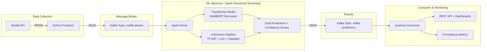

# Reddit Realtime Flair Classification

A real-time distributed ML pipeline that classifies Reddit posts from r/AskEurope using dual-model inference (Transformer + scikit-learn), with Kafka streaming, Spark processing, and Kubernetes orchestration.

## Architecture



### Pipeline Flow

1. **Producer** — Python script collects posts from Reddit API (r/AskEurope), cleans text (stopwords, lemmatization, URL normalization), and publishes to Kafka
2. **Spark Inference** — Structured Streaming job reads from Kafka, applies two models in parallel:
   - **Transformer**: Fine-tuned DistilBERT with label encoder (13 flair categories)
   - **scikit-learn**: TF-IDF → Truncated SVD (LSA) → classifier pipeline
3. **Consumer** — Quarkus app consumes predictions, tracks model agreement, confidence distributions, and exposes 7 monitoring dashboards

### Key Design Decisions

| Decision | Choice | Rationale |
|----------|--------|-----------|
| Dual-model inference | Transformer + sklearn | Compare deep learning vs classical ML in real-time; measure agreement rate |
| Message broker | Kafka (Strimzi) | Native K8s operator, handles backpressure, exactly-once semantics |
| Stream processing | Spark Structured Streaming | Micro-batch with checkpoint recovery; UDF-based model serving |
| Consumer framework | Quarkus + SmallRye | Reactive messaging, low memory footprint, Prometheus-native |
| Orchestration | Kubernetes | Strimzi for Kafka, Spark Operator for jobs, standard Deployments for services |

### Monitoring Dashboards

The Quarkus consumer serves 7 HTML dashboards:

| Dashboard | Endpoint | What it shows |
|-----------|----------|---------------|
| Metrics Overview | `/metrics.html` | Flair counts, confidence, agreement rates |
| Confusion Matrix | `/confusion-matrix.html` | Transformer vs sklearn prediction alignment |
| Confidence Distribution | `/confidence-distribution.html` | Histogram of model confidence scores |
| Agreement Over Time | `/agreement-over-time.html` | Model agreement rate trends |
| Flair Timeline | `/flair-drift.html` | Flair distribution changes over time |
| Uncertainty Zones | `/model-uncertainty.html` | Both confident / both uncertain / disagreement |
| System Load | `/system-load.html` | Processing throughput and error rates |

### Flair Categories

The models classify posts into 13 categories: Work, Misc, Food, Personal, Meta, Sports, Travel, Politics, Culture, History, Education, Language, Foreign.

## Project Structure

```
├── model/                          # Training artifacts
│   ├── model_training.ipynb        # Jupyter notebook for model training
│   ├── data_collection.py          # Reddit data collection script
│   ├── cleaning.py                 # Text preprocessing utilities
│   ├── reddit_classifier.pkl       # Trained sklearn classifier
│   ├── vectorizer.pkl              # TF-IDF vectorizer
│   └── LSA_topics.pkl              # Truncated SVD model
├── runtime/
│   ├── kafka/
│   │   ├── kafka_cluster.yaml      # Strimzi Kafka cluster (KRaft mode)
│   │   ├── producer/
│   │   │   ├── reddit_posts_processor.py   # Reddit → Kafka producer
│   │   │   ├── cleaning.py                 # Text cleaning pipeline
│   │   │   ├── Dockerfile
│   │   │   └── reddit_posts_processor.yaml # K8s Deployment
│   │   └── consumer/
│   │       ├── flair-consumer/             # Quarkus app
│   │       │   ├── src/main/java/uoc/edu/
│   │       │   │   ├── BaseResource.java              # Kafka consumer + metrics
│   │       │   │   ├── StatisticsResource.java        # /flairs/statistics
│   │       │   │   ├── ConfusionMatrixResource.java   # /flairs/confusion-matrix
│   │       │   │   ├── ConfidenceDistributionResource.java
│   │       │   │   ├── AgreementTimelineResource.java
│   │       │   │   ├── ModelUncertaintyZoneResource.java
│   │       │   │   └── TimelineResource.java
│   │       │   └── src/main/resources/META-INF/resources/
│   │       │       └── *.html              # 7 monitoring dashboards
│   │       ├── flair_consumer.yaml         # K8s Deployment + Service
│   │       └── outgoing_topic.yaml         # Kafka topic definition
│   └── spark/
│       ├── reddit_flair_spark_inference.py  # Dual-model Spark job
│       ├── Dockerfile
│       └── reddit_flair_spark_inference.yaml # SparkApplication CRD
```

## Installation

### Prerequisites

- Kubernetes cluster (Minikube, OpenShift, or cloud)
- kubectl / oc CLI
- Helm (for Spark Operator)
- Reddit API credentials (stored as K8s Secret)

### 1. Create Namespace & Install Operators

```bash
kubectl create namespace reddit-realtime

# Strimzi Kafka Operator
kubectl apply -f https://strimzi.io/install/latest?namespace=reddit-realtime -n reddit-realtime

# Spark Operator
helm repo add spark-operator https://kubeflow.github.io/spark-operator
helm install spark-operator spark-operator/spark-operator --namespace spark-operator --create-namespace --wait
```

### 2. Deploy Kafka Cluster & Topics

```bash
kubectl apply -f runtime/kafka/kafka_cluster.yaml
kubectl apply -f runtime/kafka/producer/incoming_topic.yaml
kubectl apply -f runtime/kafka/consumer/outgoing_topic.yaml
```

### 3. Create Reddit API Secret

```bash
kubectl create secret generic reddit-api-credentials \
  --from-literal=client-id=YOUR_CLIENT_ID \
  --from-literal=client-secret=YOUR_CLIENT_SECRET \
  -n reddit-realtime
```

### 4. Deploy Pipeline Components

```bash
# Spark inference job
kubectl apply -f runtime/spark/reddit_flair_spark_inference.yaml

# Reddit producer
kubectl apply -f runtime/kafka/producer/reddit_posts_processor.yaml

# Quarkus consumer
kubectl apply -f runtime/kafka/consumer/flair_consumer.yaml
```

### 5. Access Dashboards

```bash
kubectl port-forward svc/predictions-consumer 8080:80 -n reddit-realtime
# Open http://localhost:8080/metrics.html
```

## Model Training

The pre-trained models are in [`./model`](./model). To retrain:

1. Collect data: `python model/data_collection.py`
2. Run training notebook: [`model/model_training.ipynb`](./model/model_training.ipynb)
3. Rebuild Spark Docker image with new model artifacts

## Building Docker Images

```bash
# Producer
docker build -t quay.io/YOUR_USER/reddit-posts-processor:latest ./runtime/kafka/producer/
docker push quay.io/YOUR_USER/reddit-posts-processor:latest

# Spark inference
docker build -t quay.io/YOUR_USER/spark-inference:latest ./runtime/spark/
docker push quay.io/YOUR_USER/spark-inference:latest

# Quarkus consumer
cd runtime/kafka/consumer/flair-consumer
./mvnw package -Dquarkus.container-image.build=true
```
