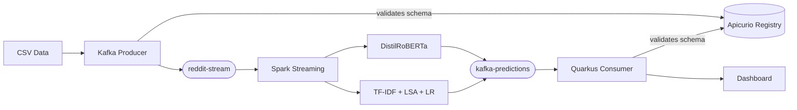

# Reddit Realtime Flair Classification

A real-time ML pipeline that classifies Reddit posts from r/AskEurope into 13 flair categories using dual-model inference (Transformer + scikit-learn), with schema governance via Apicurio Registry. Runs entirely on Kubernetes with open source tools.

Presented at **OCXConf 2026** — [presentation slides](presentation.html)

## Architecture



### Pipeline Flow

1. **Producer** — Python script reads pre-collected Reddit posts (r/AskEurope) from CSV files, cleans text (stopwords, lemmatization, URL removal), and streams them to the `reddit-stream` Kafka topic with a delay to simulate real-time ingestion.

2. **Spark Inference** — Structured Streaming job reads from Kafka and applies two models in parallel via a PySpark UDF:
   - **Transformer**: Fine-tuned DistilRoBERTa (6 layers, 12 attention heads, 768 hidden dims)
   - **scikit-learn**: TF-IDF + Truncated SVD (LSA) + Logistic Regression
   - Models are lazy-loaded once per executor to avoid PySpark UDF serialization issues

3. **Consumer** — Quarkus app consumes predictions via SmallRye Reactive Messaging, computes real-time statistics (agreement, confusion matrix, confidence distributions, uncertainty zones), and serves dashboards via REST.

4. **Schema Governance** — Apicurio Registry stores and enforces JSON Schemas for both Kafka topics, preventing schema drift between pipeline components.

### Key Design Decisions

| Decision | Choice | Rationale |
|----------|--------|-----------|
| Dual-model inference | Transformer + sklearn | Agreement rate as reliability proxy without ground truth |
| Inference inside Spark | PySpark UDFs | Avoids model-serving hop latency, keeps pipeline simple |
| In-memory analytics | ConcurrentHashMaps | Fast, zero-dependency; production would use a time-series DB |
| Schema governance | Apicurio Registry + JSON Schema | Explicit versioned contracts; backward compatibility enforcement |
| Lazy model loading | Load on first use | Sidesteps PySpark UDF serialization (can't pickle neural nets) |

### Dashboards

| Dashboard | URL | Description |
|-----------|-----|-------------|
| Metrics Overview | `/metrics.html` | Flair counts, confidence, agreement rates |
| Confusion Matrix | `/confusion-matrix.html` | Transformer vs sklearn alignment heatmap |
| Confidence Distribution | `/confidence-distribution.html` | Histogram of confidence scores |
| Uncertainty Zones | `/model-uncertainty.html` | Confident / uncertain / disagreement doughnut |

### Flair Categories

The models classify posts into 13 categories: Work, Misc, Food, Personal, Meta, Sports, Travel, Politics, Culture, History, Education, Language, Foreign.

## Quick Start

### Prerequisites

- Kubernetes cluster (Minikube with 8GB RAM / 4 CPUs recommended)
- kubectl CLI
- Helm (for Spark Operator)
- Podman or Docker (for building images)

### 1. Infrastructure

```bash
# Start Minikube
minikube start --memory=8g --cpus=4

# Create namespace
kubectl create namespace reddit-realtime

# Install Strimzi Kafka Operator
kubectl apply -f https://strimzi.io/install/latest?namespace=reddit-realtime -n reddit-realtime

# Wait for Strimzi, then deploy Kafka cluster
kubectl wait --for=condition=available deployment/strimzi-cluster-operator -n reddit-realtime --timeout=120s
kubectl apply -f runtime/kafka/kafka_cluster.yaml

# Wait for Kafka, then create topics
kubectl wait kafka/reddit-posts --for=condition=Ready -n reddit-realtime --timeout=300s

kubectl apply -f - <<EOF
apiVersion: kafka.strimzi.io/v1beta2
kind: KafkaTopic
metadata:
  name: reddit-stream
  namespace: reddit-realtime
  labels:
    strimzi.io/cluster: reddit-posts
spec:
  partitions: 1
  replicas: 1
---
apiVersion: kafka.strimzi.io/v1beta2
kind: KafkaTopic
metadata:
  name: kafka-predictions
  namespace: reddit-realtime
  labels:
    strimzi.io/cluster: reddit-posts
spec:
  partitions: 1
  replicas: 1
EOF

# Install Spark Operator (must watch spark-operator namespace)
helm repo add spark-operator https://kubeflow.github.io/spark-operator
helm repo update
helm install spark-operator spark-operator/spark-operator \
  --namespace spark-operator --create-namespace \
  --set 'spark.jobNamespaces={spark-operator}' --wait
```

### 2. Build Container Images

Build images directly inside Minikube's Docker daemon:

```bash
# Point docker CLI at Minikube's Docker daemon
eval $(minikube docker-env)

# Build all 3 images
docker build -t reddit-producer:local -f runtime/kafka/producer/Dockerfile runtime/kafka/producer/
docker build -t spark-inference:local -f runtime/spark/Dockerfile runtime/spark/
cd runtime/kafka/consumer/flair-consumer && mvn package -DskipTests -q && \
  docker build -t predictions-consumer:local -f src/main/docker/Dockerfile.jvm . && cd -
```

### 3. Deploy Pipeline

```bash
# Deploy Apicurio Registry
kubectl apply -f runtime/registry/apicurio-registry.yaml

# Deploy Spark inference job
kubectl apply -f runtime/spark/reddit_flair_spark_inference.yaml

# Deploy Quarkus consumer
kubectl apply -f runtime/kafka/consumer/flair_consumer.yaml

# Deploy producer (starts data flow)
kubectl apply -f runtime/kafka/producer/reddit_posts_processor.yaml
```

### 4. Access Services

```bash
# Consumer dashboard
kubectl port-forward -n reddit-realtime svc/predictions-consumer 8080:80 &
# Open http://localhost:8080/metrics.html

# Apicurio Registry API
kubectl port-forward -n reddit-realtime svc/apicurio-registry 8081:8080 &

# Apicurio Registry UI
kubectl port-forward -n reddit-realtime svc/apicurio-registry-ui 8083:8080 &
# Open http://localhost:8083

# Register schemas
kubectl wait --for=condition=available deployment/apicurio-registry -n reddit-realtime --timeout=120s
REGISTRY_URL=http://localhost:8081 schemas/register-schemas.sh
```

## Project Structure

```
├── model/                              # Training artifacts
│   ├── model_training.ipynb            # Jupyter notebook for model training
│   ├── data_collection.py              # Reddit data collection script
│   ├── cleaning.py                     # Text preprocessing utilities
│   ├── reddit_classifier.pkl           # Trained sklearn classifier
│   ├── vectorizer.pkl                  # TF-IDF vectorizer
│   └── LSA_topics.pkl                  # Truncated SVD model
├── runtime/
│   ├── kafka/
│   │   ├── kafka_cluster.yaml          # Strimzi Kafka cluster (KRaft mode, v4.1.0)
│   │   ├── producer/
│   │   │   ├── reddit_posts_processor.py   # CSV → Kafka producer
│   │   │   ├── cleaning.py                 # Text cleaning pipeline
│   │   │   ├── data/                        # Pre-collected Reddit CSV files
│   │   │   ├── Dockerfile
│   │   │   └── reddit_posts_processor.yaml # K8s Deployment
│   │   └── consumer/
│   │       ├── flair-consumer/             # Quarkus app
│   │       │   ├── src/main/java/uoc/edu/
│   │       │   │   ├── BaseResource.java              # Kafka consumer + in-memory analytics
│   │       │   │   ├── StatisticsResource.java        # /flairs/statistics
│   │       │   │   ├── ConfusionMatrixResource.java   # /flairs/confusion-matrix
│   │       │   │   ├── ConfidenceDistributionResource.java  # /flairs/confidence-distribution
│   │       │   │   ├── ModelUncertaintyZoneResource.java    # /flairs/uncertainty-zones
│   │       │   │   ├── AgreementTimelineResource.java       # /flairs/agreement-timeline
│   │       │   │   └── TimelineResource.java                # /flairs/timeline
│   │       │   └── src/main/resources/META-INF/resources/
│   │       │       ├── metrics.html                   # Main dashboard
│   │       │       ├── confusion-matrix.html          # Heatmap
│   │       │       ├── confidence-distribution.html   # Histogram
│   │       │       ├── model-uncertainty.html         # Uncertainty zones
│   │       │       ├── agreement-over-time.html       # Agreement trend
│   │       │       └── flair-drift.html               # Drift detection
│   │       └── flair_consumer.yaml         # K8s Deployment + Service
│   ├── spark/
│   │   ├── reddit_flair_spark_inference.py  # Dual-model inference (lazy loading)
│   │   ├── Dockerfile
│   │   └── reddit_flair_spark_inference.yaml # SparkApplication CRD
│   └── registry/
│       └── apicurio-registry.yaml          # Apicurio Registry K8s Deployment
├── schemas/
│   ├── reddit-stream-value.json            # JSON Schema for reddit-stream topic
│   ├── kafka-predictions-value.json        # JSON Schema for kafka-predictions topic
│   └── register-schemas.sh                 # Schema registration script
├── presentation.html                       # OCXConf 2026 slide deck
└── PRESENTATION_GUIDE.md                   # Speaker notes and setup guide
```

## Model Training

The pre-trained models are in [`./model`](./model). To retrain:

1. Collect data: `python model/data_collection.py`
2. Run training notebook: [`model/model_training.ipynb`](./model/model_training.ipynb)
3. Rebuild Spark Docker image with new model artifacts

## Related

- [Apicurio Registry](https://github.com/Apicurio/apicurio-registry) — The schema registry used for governance
- [Strimzi](https://strimzi.io/) — Kafka on Kubernetes
- [Spark Operator](https://github.com/kubeflow/spark-operator) — Spark on Kubernetes
